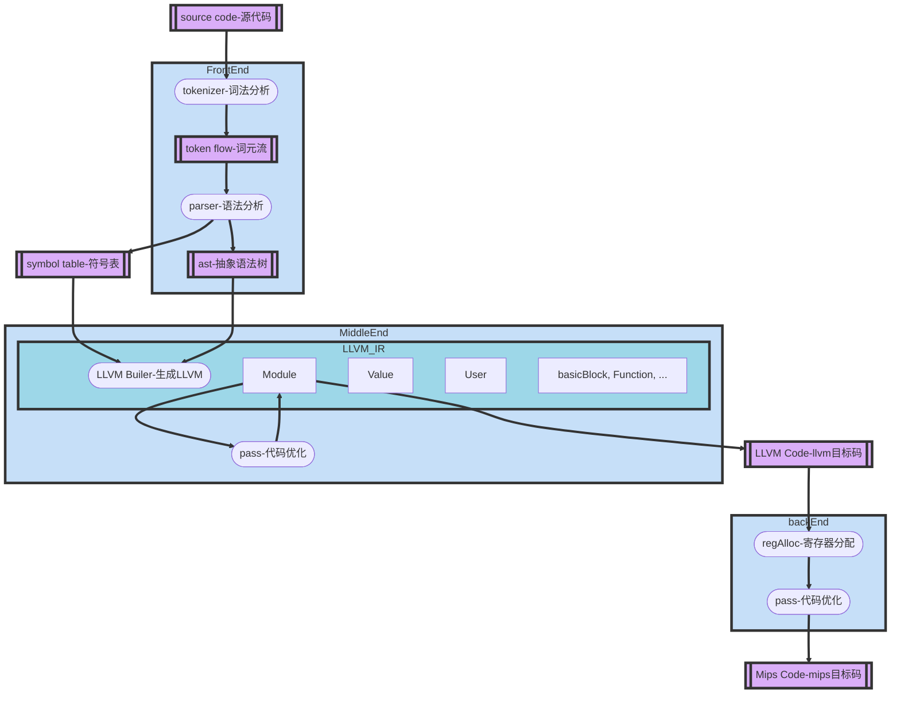
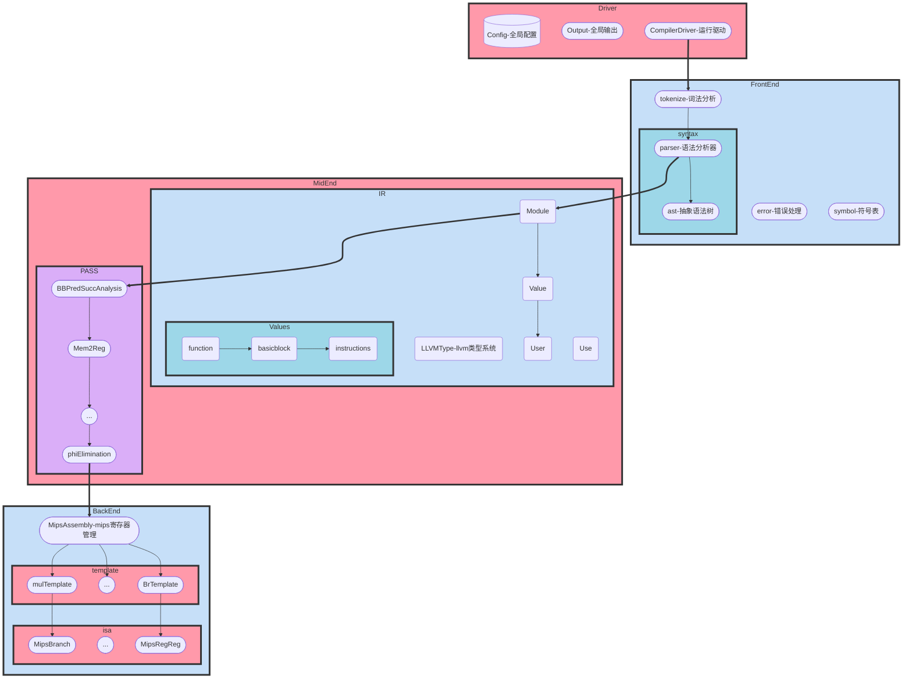

# TrivialSysY Compiler

| An optimized compiler that translates SysY(a subset of C) to LLVM_IR&MIPS | Jiarui Wu | email：wujiarui@buaa.edu.cn |
| ------------------------------------------------------------ | --------- | --------------------------- |

------

[Document-CN](https://github.com/gnwekge78707/TrivialSysY/blob/master/TECH_REPORT.md) | [Document-EN](https://github.com/gnwekge78707/TrivialSysY/blob/master/TECH_REPORT.md)

This project implements a [Sysy language](https://gitlab.eduxiji.net/nscscc/docs/-/blob/master/SysY%E8%AF%AD%E8%A8%80%E5%AE%9A%E4%B9%89.pdf) optimized compilation system with LLVM_IR and MIPS dual backends. This compiler uses java as the programming language, and refers to excellent projects such as LLVM in terms of architecture. It supports part of the C language grammar (the specific grammar is Sysy2021, which supports all Sysy features including multidimensional arrays), and implements multiple optimization algorithm to boost performance. The design and implementation of this compiling system will be further described below.


## Architecture



- It can be seen that this compiler mainly consists of frontend, middle-end and backend:
  - The front end preforms lexical analysis and syntax analysis, which can generate **Abstract Syntax Tree** representation from source files, and perform certain semantic analysis and error handling.
  - **The middle end is LLVM IR**, which is divided into abstract structures such as Value, Module, User, and Use according to the architecture of the llvm compiler. The front end and the middle end will collaborate to convert AST to LLVM IR. And some optimizations will be carried out in the mid-end, the most important ones include dominance analysis, alias analysis, Mem2Reg, global value label (equivalent to propagation merge + common subexpression deletion), phi node deletion, dead code deletion, branch optimization, active variable analysis, conflict graph construction, etc.
  - After the conflict graph is built, the backend will do register allocation. The backend outputs **Mips Assembly Code**, which manages a LLVMIR-to-MIPS generation template, mips isa instructions, and mips registers.


### System Diagram





### File Structure

```scss
├─backend
│  ├─isa
│  └─template
├─driver
├─frontend
│  ├─error
│  ├─exceptions
│  ├─symbol
│  ├─syntax
│  │  ├─decl
│  │  │  ├─ast
│  │  │  └─parse
│  │  ├─expr
│  │  │  ├─ast
│  │  │  └─parse
│  │  ├─func
│  │  │  ├─ast
│  │  │  └─parse
│  │  └─stmt
│  │      ├─ast
│  │      └─parser
│  └─tokenize
├─midend
│  ├─ir
│  │  ├─type
│  │  └─value
│  │      └─instr
│  │          ├─binary
│  │          ├─mem
│  │          └─terminator
│  └─pass
└─util
```


## Supported Grammar (in BNF)

````markdown
## original syntax
CompUnit        := {ConstDecl | VarDecl} {FuncDef} MainFuncDef
### EXPR
```text
<Exp>           := <AddExp>
<Cond>          := <LOrExp>
<LVal>          := Ident { '[' <Exp> ']' } // 普通变量，一维或二维数组
<PrimaryExp>    := '(' <Exp> ')' | <LVal> | <Number> // 三种情况, 子表达式, 左值, 字面量
<Number>        := IntConst
<UnaryExp>      := <PrimaryExp> | <Ident> '(' [ <FuncRParams> ] ')' | <UnaryOp> <UnaryExp> // PrimaryExp 或者 FunctionCall 或者含有一元运算符
<UnaryOp>       := '+' | '-' | '!'  // '!' 仅能在条件表达式中出现
<FuncRParams>   := <Exp> { ',' <Exp> } 
<MulExp>        := <UnaryExp> | <MulExp> ( '*' | '/' | '%' ) <UnaryExp>
<AddExp>        := <MulExp> | <AddExp> ( '+' | '-' ) <MulExp>
<RelExp>        := <AddExp> | <RelExp> ( '<' | '>' | '<=' | '>=' ) <AddExp>
<EqExp>         := <RelExp> | <EqExp> ( '==' | '!=' ) <RelExp>
<LAndExp>       := <EqExp> | <LAndExp> '&&' <EqExp>
<LOrExp>        := <LAndExp> | <LOrExp> '||' <LAndExp>
```
### STMT 
```text
<Stmt> := <LVal> '=' <Exp> ';'
    | [<Exp>] ';'
    | <Block>
    | 'if' '(' <Cond> ')' <Stmt> [ 'else' <Stmt> ]
    | 'while' '(' <Cond> ')' <Stmt>
    | 'break' ';' | 'continue' ';'
    | 'return' [<Exp>] ';'
    | <LVal> '=' 'getint' '(' ')' ';'
    | 'printf' '(' FormatString { ',' <Exp> } ')' ';'

<BlockItem> := <Decl> | <Stmt>  // <Decl> 目前还未分析，相应代码暂时留空，下一节补上

<Block> := '{' { <BlockItem> } '}'
```
### DECL
```text
<Decl>          := <ConstDecl> | <VarDecl>
<BType>         := 'int'
// Const
<ConstDecl>     := 'const' <BType> <ConstDef> { ',' <ConstDef> } ';'
<ConstDef>      := Ident { '[' <ConstExp> ']' } '=' <ConstInitVal>
<ConstInitVal>  := <ConstExp> | '{' [ <ConstInitVal> { ',' <ConstInitVal> } ] '}'
// Var
<VarDecl>       := <BType> <VarDef> { ',' <VarDef> } ';'
<VarDef>        := Ident { '[' <ConstExp> ']' } | Ident { '[' <ConstExp> ']' } '=' <InitVal>
<InitVal>       := <Exp> | '{' [ <InitVal> { ',' <InitVal> } ] '}'
```
### FUNC
```text
<FuncDef>       := <FuncType> Ident '(' [<FuncFParams> ] ')' <Block>
<MainFuncDef>   := 'int' 'main' '(' ')' <Block>
<FuncType>      := 'void' | 'int'
<FuncFParams>   := <FuncFParam> { ',' <FuncFParam> }
<FuncFParam>    := <BType> Ident [ '[' ']' { '[' <ConstExp> ']' } ]
```
````

