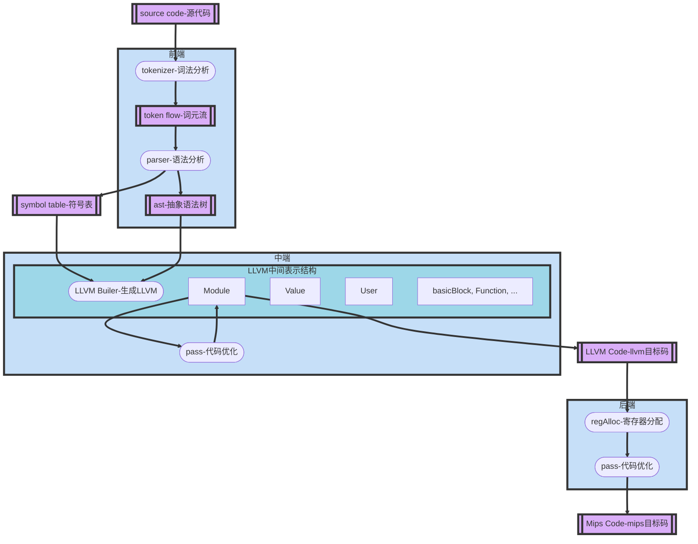
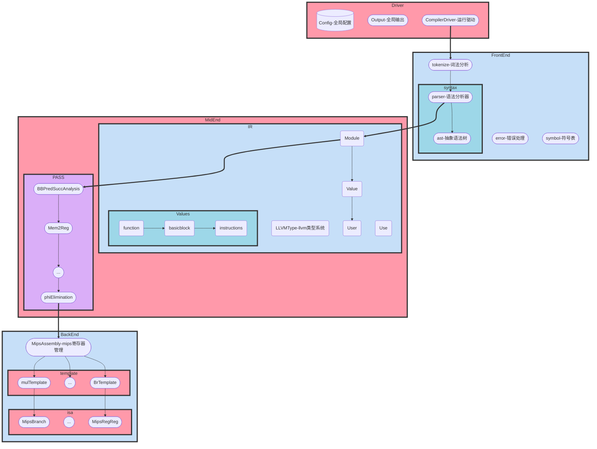
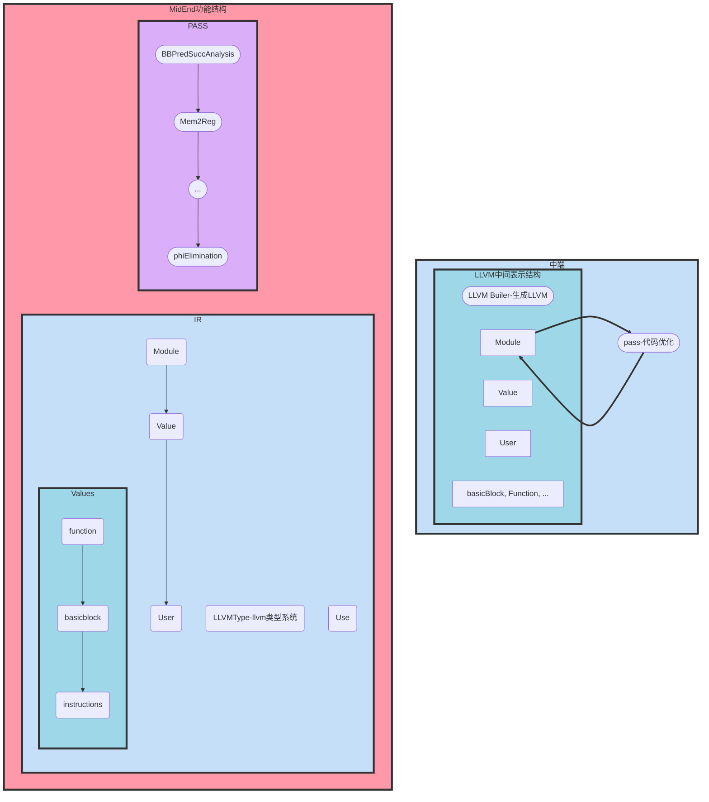

# TrivialSysy编译系统

| 基于 LLVM_IR 和 MIPS 双后端的 Sysy 语言优化编译系统 | 作者：Jiarui Wu（北京航空航天大学计算机学院） | email：wujiarui@buaa.edu.cn |
| --------------------------------------------------- | --------------------------------------------- | --------------------------- |

------

【摘要】本项目实现了一个 [Sysy 语言](https://gitlab.eduxiji.net/nscscc/docs/-/commit/b6cd2ebab7d15bb1055a1722fdfa8445b6516965) 的拥有 LLVM_IR 和 MIPS 双后端的优化编译系统。本编译系统使用java作为程序设计语言，在架构上参考LLVM等优秀项目，在功能上支持部分C语言文法（具体文法为Sysy2021，支持包括多维数组在内的所有Sysy特征），性能上实现了多种优化pass并获得不错的竞速结果。下面对本编译系统的设计和实现进行进一步的说明。

**目录**

[TOC]

------


## 一、总体设计

### 1.1 功能结构和流程图



可见，本编译系统主要分为前中后端：

- 前端为词法分析和语法分析，能够从源文件生成**抽象语法树**表示，并且进行一定的语义分析和错误处理。
- **中端为LLVM IR**表示，按照llvm编译器的架构，分为Value，Module，User，Use等抽象结构。前端和中端会合作将ast转化为LLVM IR。并且中端将进行一些优化，最主要的包括支配分析，别名分析，Mem2Reg，全局值标号（相当于传播合并+公共子表达式删除），phi结点删除，死代码删除，分支优化，活跃变量分析，冲突图构建等。
- 冲突图构建后，后端将进行寄存器分配。后端输出**Mips汇编码**，管理一个LLVMIR到MIPS的生成模板、mips isa指令、以及mips的寄存器。


### 1.2 体系结构图




- 上图显示的为前端-中端-后端的体系结构。具体的内容将在后面进行展开。


### 1.3 文件结构和代码量

```scss
├─backend
│  ├─isa
│  └─template
├─driver
├─frontend
│  ├─error
│  ├─exceptions
│  ├─symbol
│  ├─syntax
│  │  ├─decl
│  │  │  ├─ast
│  │  │  └─parse
│  │  ├─expr
│  │  │  ├─ast
│  │  │  └─parse
│  │  ├─func
│  │  │  ├─ast
│  │  │  └─parse
│  │  └─stmt
│  │      ├─ast
│  │      └─parser
│  └─tokenize
├─midend
│  ├─ir
│  │  ├─type
│  │  └─value
│  │      └─instr
│  │          ├─binary
│  │          ├─mem
│  │          └─terminator
│  └─pass
└─util
```

代码量如下：

| path                             | files |   code | comment | blank |  total |
| :------------------------------- | ----: | -----: | ------: | ----: | -----: |
| .                                |   199 | 12,263 |     923 | 1,707 | 14,893 |
| Resourse                         |    11 |  1,122 |     303 |    70 |  1,495 |
| autotest                         |     8 |    511 |      28 |    57 |    596 |
| backend                          |    16 |  1,530 |     132 |   191 |  1,853 |
| backend\isa                      |     8 |    291 |      22 |    79 |    392 |
| backend\template                 |     6 |    959 |      24 |    78 |  1,061 |
| driver                           |     3 |    284 |      10 |    48 |    342 |
| frontend                         |    75 |  3,707 |     204 |   657 |  4,568 |
| frontend\error                   |     2 |     84 |       0 |    26 |    110 |
| frontend\exceptions              |     2 |     18 |       0 |     7 |     25 |
| frontend\symbol                  |     4 |    287 |       8 |    61 |    356 |
| frontend\syntax                  |    58 |  2,675 |     169 |   465 |  3,309 |
| frontend\syntax\decl             |    10 |    428 |      15 |    66 |    509 |
| frontend\syntax\decl\ast         |     3 |    211 |       9 |    26 |    246 |
| frontend\syntax\decl\parse       |     7 |    217 |       6 |    40 |    263 |
| frontend\syntax\expr             |    22 |    965 |      76 |   183 |  1,224 |
| frontend\syntax\expr\ast         |     7 |    620 |      60 |    84 |    764 |
| frontend\syntax\expr\parse       |    15 |    345 |      16 |    99 |    460 |
| frontend\syntax\func             |     8 |    276 |      26 |    52 |    354 |
| frontend\syntax\func\ast         |     3 |    139 |      20 |    26 |    185 |
| frontend\syntax\func\parse       |     5 |    137 |       6 |    26 |    169 |
| frontend\syntax\stmt             |    12 |    691 |      32 |    88 |    811 |
| frontend\syntax\stmt\ast         |    10 |    441 |      15 |    68 |    524 |
| frontend\syntax\stmt\parser      |     2 |    250 |      17 |    20 |    287 |
| frontend\tokenize                |     6 |    281 |      27 |    57 |    365 |
| midend                           |    41 |  3,785 |     220 |   548 |  4,553 |
| midend\ir                        |    26 |  1,851 |     110 |   382 |  2,343 |
| midend\ir\type                   |     1 |     93 |       0 |    34 |    127 |
| midend\ir\value                  |    19 |  1,321 |      74 |   253 |  1,648 |
| midend\ir\value\instr            |    14 |    928 |      56 |   161 |  1,145 |
| midend\ir\value\instr\binary     |     1 |    148 |       4 |    16 |    168 |
| midend\ir\value\instr\mem        |     8 |    386 |      46 |    87 |    519 |
| midend\ir\value\instr\terminator |     3 |    244 |       3 |    27 |    274 |
| midend\pass                      |    15 |  1,934 |     110 |   166 |  2,210 |
| util                             |     2 |    169 |      10 |    39 |    218 |


## 二、词法的设计和实现

### 前端词法分析部分设计：UML图


### 前端词法分析部分实现

- 首先将源文件读入，抽象成Source类进行管理，方便词法分析器一个一个的判断token。

- 此后，建立Token类管理每一个单词。构造器为Tokenizer，将Source转化为Token的列表。

  - Token类结构：

    ```java
    public abstract class Token {
        private final int line;
        private final int startIdx;
        private final int endIdx;
        private final String value;
        private final TokenType tokenType;
    
        public static Token getInstance(int line, int startIdx, int endIdx, String value, TokenType tokenType) {
            
        }
    
        protected Token(int line, int startIdx, int endIdx, String value, TokenType tokenType) {
            
        }
    
        public enum TokenType {
            
        }
    }
    ```

    

  - Token有几个子类，对应不同种类的单词。分别为以下四种：

    ```java
    switch (tokenType) {
                case IDENFR: return new Ident(line, startIdx, endIdx, value);
                case INTCON: return new IntConst(line, startIdx, endIdx, value);
                case STRCON: return new FormatStr(line, startIdx, endIdx, value);
                default: return new Reserved(line, startIdx, endIdx, value, tokenType);
            }
    ```

  - Tokenizer的实现，主要使用正则表达式：

    ```java
    Pattern pattern = tokenType.getPattern();
                    Matcher matcher = pattern.matcher(source.getRestLine());
                    if (matcher.find()) {
                        matchedToken = Token.getInstance(
                                source.getLineIdx(), source.getColIdx(),
                                source.getColIdx() + matcher.end(), matcher.group(0), tokenType);
                        tokens.add(matchedToken);
                        source.step(matcher.group(0).length());
                        break;
                    }
    ```

    

## 三、语法分析的设计和实现

### 前端文法分析部分设计：AST和文法对应结构、UML图

- **注意：本编译器接受的源语言并不是Sysy的子集，而是Sysy2021的完整语法**：也就是说，实现了多维数组等功能。

- **文法修改与文法对应**：为了保证实现的优雅，在设计中**未对文法做大量更改**。而值得注意的是，前端采取的AST数据结构与文法分析中非终结符的对应关系是较为特殊的：这里进行展示。

  - 下图中，我首先将文法规则分成四类：表达式类EXPR，声明类DECL，语句类STMT，和函数类FUNC。

  - 下图中，每一句文法规则下面，对应的文法左部的AST节点，以及文法右部的AST节点。

    例如：

    ```markdown
    __________________________________________________________________________________
    <LVal>          := Ident { '[' <Exp> ']' } // 普通变量，一维或二维数组
    ------------------> LValNode
    -----------------{| Token, Exp (AddExpNode)
    __________________________________________________________________________________
    ```

    表示：这个规则的左部非终结符，对应的AST节点是LValNode；右部终结符和非终结符对应AST的节点是Token, Exp (AddExpNode)。

  - 下面展示图：

    ````markdown
    CompUnit        := {ConstDecl | VarDecl} {FuncDef} MainFuncDef
    ### EXPR
    ```text
    __________________________________________________________________________________
    <Exp>           := <AddExp>
    ------------------> /
    -----------------{| BinaryExpNode
    __________________________________________________________________________________
    <Cond>          := <LOrExp>
    ------------------> /
    -----------------{| BinaryExpNode
    __________________________________________________________________________________
    <LVal>          := Ident { '[' <Exp> ']' } // 普通变量，一维或二维数组
    ------------------> LValNode
    -----------------{| Token, Exp (AddExpNode)
    __________________________________________________________________________________
    <PrimaryExp>    := '(' <Exp> ')' | <LVal> | <Number> // 三种情况, 子表达式, 左值, 字面量
    ------------------> /
    -----------------{| Exp (AddExpNode) | LValNode | NumberNode
    __________________________________________________________________________________
    <Number>        := IntConst
    ------------------> TokenNode
    -----------------{| Token
    __________________________________________________________________________________
    <UnaryExp>      := <PrimaryExp> | <Ident> '(' [ <FuncRParams> ] ')' | <UnaryOp> <UnaryExp> // PrimaryExp 或者 FunctionCall 或者含有一元运算符
    ------------------> /
    -----------------{| PrimaryExp (ExpNode | LValNode | NumberNode)
    ------------------| FuncCallNode (Token, FuncRParamsNode)
    ------------------| UnaryExpNode (Token, UnaryExp...)
    __________________________________________________________________________________
    <UnaryOp>       := '+' | '-' | '!'  // '!' 仅能在条件表达式中出现
    ------------------> TokenNode
    __________________________________________________________________________________
    <FuncRParams>   := <Exp> { ',' <Exp> } 
    ------------------> FuncRParamsNode
    -----------------{| Exp (AddExpNode)
    __________________________________________________________________________________
    <MulExp>        := <UnaryExp> { ('*' | '/' | '%') <UnaryExp>}
    ------------------> BinaryExpNode
    -----------------{| UnaryExp (PrimaryExp (AddExpNode | LValNode | NumberNode) | FuncCallNode | UnaryExpNode)
    __________________________________________________________________________________
    <AddExp>        := <MulExp> { ('+' | '−') <MulExp>}
    ------------------> BinaryExpNode
    -----------------{| BinaryExpNode
    <RelExp>        := <AddExp> { ('<' | '>' | '<=' | '>=') <AddExp>}
    
    <EqExp>         := <RelExp> { ('==' | '!=') <RelExp>}
    
    <LAndExp>       := <EqExp> { '&&' <EqExp>}
    
    <LOrExp>        := <LAndExp> { '||' <LAndExp>}
    
    <ConstExp>      := <AddExp>
    
    ```
    ### DECL
    `<a> = <b> | <a>{<a>}` 's node can be like `<a> -> <a><b><a><b>...`
    ```text
    <BType>         := 'int'
    ------------------> TokenNode
    __________________________________________________________________________________
    // Const
    <ConstDecl>     := 'const' <BType> <ConstDef> { ',' <ConstDef> } ';'
    ------------------> varDeckNode
    -----------------{| varDefNode
    __________________________________________________________________________________
    <ConstDef>      := Ident { '[' <ConstExp> ']' } '=' <ConstInitVal>
    ------------------> varDefNode
    -----------------{| Token, {AddExpNode}, AddExpNode | InitValNode
    __________________________________________________________________________________
    <ConstInitVal>  := <ConstExp> | '{' [ <ConstInitVal> { ',' <ConstInitVal> } ] '}'
    ------------------> InitValNode
    -----------------{| InitValNode
    __________________________________________________________________________________
    // Var
    <VarDecl>       := <BType> <VarDef> { ',' <VarDef> } ';'
    ------------------> 
    -----------------{| 
    __________________________________________________________________________________
    <VarDef>        := Ident { '[' <ConstExp> ']' }  [ '=' <InitVal> ]
    ------------------> 
    -----------------{| 
    __________________________________________________________________________________
    <InitVal>       := <Exp> | '{' [ <InitVal> { ',' <InitVal> } ] '}'
    ------------------> 
    -----------------{| 
    ```
    ### STMT
    ```text
    __________________________________________________________________________________
    <Stmt> := <LVal> '=' <Exp> ';'
        | <Exp> ';'
        | ';'
        | <Block>
        | 'if' '(' <Cond> ')' <Stmt> [ 'else' <Stmt> ]
        | 'while' '(' <Cond> ')' <Stmt>
        | 'break' ';' | 'continue' ';'
        | 'return' [<Exp>] ';'
        | <LVal> '=' 'getint' '(' ')' ';'
        | 'printf' '(' FormatString { ',' <Exp> } ')' ';'
    __________________________________________
    ------------------> AssignNode
    -----------------{| LValNode, Exp (AddExpNode)
    __________________________________________
    ------------------> ConditionNode
    -----------------{| Cond (BinaryExpNode), Stmt, Stmt
    __________________________________________
    ------------------> LoopNode
    -----------------{| Cond (BinaryExpNode), Stmt
    __________________________________________
    ------------------> ContinueNode, BreakNode
    -----------------{| /
    __________________________________________
    ------------------> ReturnNode
    -----------------{| Exp (AddExpNode)
    __________________________________________
    ------------------> PrintNode
    -----------------{| Token (FormatString), {Exp (AddExpNode)}
    __________________________________________________________________________________
    <Block> := '{' { ConstDecl | VarDecl | Stmt } '}'
    ------------------> BlockNode
    -----------------{| VarDeclNode 
    ------------------| Stmt (BlockNode | AddExpNode | AssignNode | ConditionNode |
    --------------------------LoopNode | ContinueNode | BreakNode | ReturnNode | PrintNode)
    __________________________________________________________________________________
    ```
    ### FUNC
    ```text
    <FuncDef>       := <FuncType> Ident '(' [<FuncFParams> ] ')' <Block>
    ------------------> FuncDefNode
    -----------------{| BType (TokenNode), Token, [], BlockNode
    __________________________________________________________________________________
    <MainFuncDef>   := 'int' 'main' '(' ')' <Block>
    ------------------> /
    -----------------{| BlockNode
    __________________________________________________________________________________
    <FuncType>      := 'void' | 'int'
    ------------------> TokenNode
    -----------------{| 
    __________________________________________________________________________________
    <FuncFParams>   := <FuncFParam> { ',' <FuncFParam> }
    ------------------> FuncFParamsNode
    -----------------{| FuncFParamNode
    __________________________________________________________________________________
    <FuncFParam>    := <BType> Ident [ '[' ']' { '[' <ConstExp> ']' } ]
    ------------------> FuncFParamNode
    -----------------{| TokenNode, Token, {AddExpNode}
    __________________________________________________________________________________
    <CompUnit>      := {<ConstDecl> | <VarDecl>} {<FuncDef>} <MainFuncDef>
    ------------------> RootNode
    -----------------{| {VarDefNode} {FuncDefNode} BlockNode
    ```
    ````

    

- **UML图**：由于代码量过于庞大，不显示UML图。


### 前端文法分析部分实现

这一部分主要就是总结为两类：一是**数据结构**，我使用抽象文法树来表示。二是**数据操作**：我参考LLVM编译器的Visitor，但是用更加结构化的方式组织代码。最终的实现，是对Sysy语言的语法结构进行了抽象与总结，然后分部分按类进行文法分析。

**数据结构**（AST抽象文法树）：

- 设置了基类NodeBase，用于管理所有的Node。NodeBase代码结构如下：

  ```java
  public abstract class NodeBase {
      private SyntaxType syntaxType;
      private NodeBase parent;
      private SymbolTable lastSymbolTable;
      private HashMap<Error.ErrorType, Token> errorTokens = new HashMap<>();
  
      public NodeBase(NodeBase parent, SyntaxType syntaxType) {
          this.parent = parent;
          this.syntaxType = syntaxType;
      }
  
      public SyntaxType getSyntaxType() {
      }
  
      public void setParent(NodeBase parent) {
      }
  
      public NodeBase getParent() {
      }
  
      public SymbolTable getLastSymbolTable() {
      }
  
      public void updateLastSymbolTable() {
      }
  
      public void addErrorTokens(Token token, Error.ErrorType errorType) {
      }
  
      public int getErrorLine(Error.ErrorType errorType) {
      }
  
      public Token getErrorToken(Error.ErrorType errorType) { return this.errorTokens.get(errorType); }
  
      public void handleError(Error.ErrorType errorType) {
      }
  
      public abstract void buildIR(ModuleBuilder builder);
  }
  ```

- 数据组织：AST抽象的具体文法单元，见上面的设计部分。

- 支持的文法单元类型：

  ```java
  public enum SyntaxType {
          EXP,
          COND,
          LVAL,
          PRIMARYEXP,
          NUMBER,
          UNARYEXP,
          UNARYOP,
          FUNCRPARAMS,
          MULEXP,
          ADDEXP,
          RELEXP,
          EQEXP,
          LANDEXP,
          LOREXP,
          CONSTEXP,
  
          TOKEN,
          BTYPE,
          CONSTDECL,
          CONSTDEF,
          CONSTINITVAL,
          VARDECL,
          VARDEF,
          INITVAL,
  
          STMT,
          BLOCK,
  
          FUNCDEF,
          MAINFUNCDEF,
          FUNCTYPE,
          FUNCFPARAMS,
          FUNCFPARAM,
          COMPUNIT
      }
  ```

  

**数据操作：parse的过程**

- 当然，使用的是递归下降法来分析这个上下文无关文法。

- parse的过程有一个大致的框架，抽象成ParserBase类：

  ```java
  
  public abstract class ParserBase {
      private final Tokenizer tokenizer;
      private Token currentToken;
  
      public ParserBase(Tokenizer tokenizer) {
          this.tokenizer = tokenizer;
          this.currentToken = null;
      }
  
      protected NodeBase node;
  
      public NodeBase getNode() {
      }
  
      public Token getCurrentToken() {
      }
  
      public void updateToken() {
      }
  
      public boolean checkToken(Token.TokenType... expectedTypes) {
      }
  
      public boolean lookForward(Token.TokenType tokenType) {
      }
  
      public boolean lookForward(HashSet<Token.TokenType> tokenTypes) {
      }
  
      public void step() { tokenizer.step(); }
  
      public void reverse() {
      }
  
      public void putCheckpoint() { tokenizer.putCheckpoint(); }
  
      public void restoreCheckpoint() { tokenizer.restoreCheckpoint(); }
  
      public void handleError(Error.ErrorType errorType) {
      }
  }
  ```


### 实现难点

- parser的流程可以用下面的伪代码描述：

  - ```css
    - myParserDesign
      - **lookForward**朝前看基本步骤:
        - updateToken();
        - if lookForward 函数匹配
          - if 匹配的终结符在 当前文法 中是终结符
            - step
          - if 匹配的终结符在 当前文法 中属于某非终结符
            - reverse
        - else
          - reverse
      - **checkToken**相当于先updateToken，如果匹配则前进，否则reverse:
        - if !checkToken(...)
          - handleError 注意前一个非终结符的含义
      - 回溯基本步骤:
        - 确定回溯点 putCheckpoint()
          - 回溯点之前，一定要处于step过或reverse过的状态 in definite state
        - 正常parse操作
        - 决定点，不匹配则回溯 restoreCheckpoint()
    ```

    

- 难点：判断LVAL or EXP：

  - ```
    - 左值是可以包含于表达式的，即表达式可以是一个左值，也可在左值后面接别的东西
    - 在STMTParser里面，需要决定LVAL EXP，LVAL分析到'='之u后，可以确定是否是EXP（EXP不会接=）。如何不回溯？
      - 法一：把LVAL当成EXP处理，如果得到的EXP只包含LVAL，则重新提取出LVAL
      - 法二：直接处理，先读出LVAL，再通过特殊的方法构造EXP（传入已经解析好的LVAL）
      - 法三：允许回溯
      - 应该考虑拓展性的选择
    ```


## 四、错误处理和符号表设计和实现

### 错误处理

错误处理在前端parse的时候就开始，在前端checkError的时候进行。

- **parse的时候，处理语法错误**。

  ```java
  public void handleError(Error.ErrorType errorType) {
          if (!errorType.equals(Error.ErrorType.UNDEFINED_ERROR)) {
              /* TODO */
              //Token token = tokenizer.getPrevToken();
              Token token = tokenizer.getPrevToken();
              ErrorBuffer.getInstance().addError(new Error(errorType, token.getLine(), token.getEndIdx()));
          }
      }
  ```

  

- **checkError**的时候，构建符号表，同时**处理语义错误**。

  ```java
  public void handleError(Error.ErrorType errorType) {
          if (!errorType.equals(Error.ErrorType.UNDEFINED_ERROR)) {
              /* TODO */
              //Token token = tokenizer.getPrevToken();
              assert errorTokens.containsKey(errorType);
              Token token = errorTokens.get(errorType);
              ErrorBuffer.getInstance().addError(new Error(errorType, token.getLine(), token.getEndIdx()));
          }
      }
  ```

  


### 符号表管理

- 将函数和左值分别管理。

- 符号表采用树形结构，实际上就是记录了每一个Scope的栈式符号表。

- 符号表类：

  ```java
  public class SymbolTable {
      private HashMap<String, Symbol> symbolMap = new HashMap<>();
      private SymbolTable lastSymbolTable;
      private FuncSymbol currentFunction;
  
      public SymbolTable(SymbolTable lastSymbolTable) {
          this.lastSymbolTable = lastSymbolTable;
      }
  
      public SymbolTable(SymbolTable lastSymbolTable, FuncSymbol currentFunction) {
          this.lastSymbolTable = lastSymbolTable;
          this.currentFunction = currentFunction;
      }
  
      public void addSymbol(Symbol symbol) {
      }
  
      public SymbolTable getLastSymbolTable() {
      }
  
      public FuncSymbol getCurrentFunction() {
      }
  
      public Symbol getSymbol(String name, boolean inThisScope) {
      }
  
      public FuncSymbol getFuncSymbol(String name, boolean inThisScope) {
      }
  
      public LValSymbol getLValSymbol(String name, boolean inThisScope) {
      }
  
  }
  ```

- 类的关系如下：


## 五、LLVM中间代码生成的设计和实现

### LLVM中间表示体系结构说明

- 本编译器使用**LLVM作为中间表示**。中间表示的数据结构是模仿LLVM编译器中的层次化的结构。同时，支持将中间表示导出为本编译系统的**第一个目标码：LLVMIR**。
- LLVM体系结构如下：


### 系统实现说明

中端实现的体系结构和功能结构如下所示



下面将分LLVM类型系统，抽象层次，指令三个层次分析。

#### LLVM-1-类型系统

- 如下所示，类型系统主要分为：

  - Array表示数组。这里用一维数组模拟高维数组。具体的转化，实现在了符号表管理中：

    ```java
    public Value dimensions2indexAtBase(ArrayList<Value> dims, ModuleBuilder builder) {
    }
    ```

    上面这个函数接口就能实现数组索引下标的转换。

  - Function为函数。

  - Int为整形，有i32，i1两种。

  - Label为标签。

  - Pointer为指针。

  - Void为空。

```java

public class LLVMType {
    public static class Array extends LLVMType {
        private final int length;
        private final LLVMType type;

        public Array(LLVMType type, int length) {
        }
    }

    public static class Function extends LLVMType {
        private final LLVMType retType;
        private final ArrayList<LLVMType> paramsType;

        public Function(LLVMType retType, ArrayList<LLVMType> paramsType) {
        }
    }

    public static class Int extends LLVMType {
        private static final Int i32 = new Int(32);
        private static final Int i1 = new Int(1);
    }

    public static class Label extends LLVMType {
        private final static Label label = new Label();

        private Label() {}

        public static Label getLabel() { return label; }
    }

    public static class Pointer extends LLVMType {
        private final LLVMType pointedTo;

        public Pointer(LLVMType type) { this.pointedTo = type; }

        public LLVMType getPointedTo() { return pointedTo; }

    }

    public static class Void extends LLVMType {
        private final static Void type = new Void();

        private Void() {}

        public static Void getVoid() { return type; }
    }
}
```

#### LLVM-2-抽象层次

上面对于Module, Value, User, Use, BB, Function, Constant, GV的描述已经足够清晰。

而每个类别的代码这里就不赘述。


#### LLVM-3-指令

本编译系统生成的LLVM主要有如下这些类别的指令：

```java
public enum InstrType {
        ADD, SUB, MUL, SDIV, SREM, XOR, AND, OR, EQ, NE, SLE, SLT, SGE, SGT,
        BR, CALL, RET,
        ALLOCA, LOAD, STORE, GETELEMENTPTR, ZEXT, PHI,
        COPY, MOVE,
        PUTSTR;
}
```


## 六、MIPS目标码的设计和实现

### MIPS管理寄存器

寄存器分成如下几类：

```java
public class MipsAssembly {
    public static final int zero = 0;
    public static final int at = 1;
    public static final int v0 = 2;
    public static final int v1 = 3;
    public static final int a0 = 4;
    public static final int gp = 28;
    public static final int sp = 29;
    public static final int ra = 31;

    public static int[] globalRegisterPool = {
            17, 18, 19, 20, 21, 22, 23, 24, 25, 26, 27, 30
    };
    public static int[] localRegisterPool = {
            5, 6, 7, 8, 9, 10, 11, 12, 13, 14, 15, 16
    };
    public static final int[] registerPool = {
            5, 6, 7, 8, 9, 10, 11, 12, 13, 14, 15, 16, 17, 18, 19, 20, 21, 22, 23, 24, 25, 26, 27, 30
    };
}
```

有特殊的几类寄存器，以及全局和局部寄存器。按照mips寄存器使用规范调用。

### MIPS指令结构

支持下面这些指令：

```java
public static MipsRegRegCal getAddu(int dst, int src1, int src2) {
        return new MipsRegRegCal("addu", dst, src1, src2);
    }

    public static MipsRegRegCal getSubu(int dst, int src1, int src2) {
        return new MipsRegRegCal("subu", dst, src1, src2);
    }

    public static MipsRegRegCal getAdd(int dst, int src1, int src2) {
        return new MipsRegRegCal("add", dst, src1, src2);
    }

    public static MipsRegRegCal getSub(int dst, int src1, int src2) {
        return new MipsRegRegCal("sub", dst, src1, src2);
    }

    public static MipsRegRegCal getSlt(int dst, int src1, int src2) {
        return new MipsRegRegCal("slt", dst, src1, src2);
    }

    public static MipsRegRegCal getSle(int dst, int src1, int src2) {
        return new MipsRegRegCal("sle", dst, src1, src2);
    }

    public static MipsRegRegCal getSgt(int dst, int src1, int src2) {
        return new MipsRegRegCal("sgt", dst, src1, src2);
    }

    public static MipsRegRegCal getSge(int dst, int src1, int src2) {
        return new MipsRegRegCal("sge", dst, src1, src2);
    }

    public static MipsRegRegCal getSne(int dst, int src1, int src2) {
        return new MipsRegRegCal("sne", dst, src1, src2);
    }

    public static MipsRegRegCal getSeq(int dst, int src1, int src2) {
        return new MipsRegRegCal("seq", dst, src1, src2);
    }

    public static MipsRegRegCal getXor(int dst, int src1, int src2) {
        return new MipsRegRegCal("xor", dst, src1, src2);
    }
    /**
     *  Cal Instr on Reg op Reg ============================================
     */
    public static MipsMulDiv getMult(int src1, int src2) {
        return new MipsMulDiv("mult", src1, src2);
    }

    public static MipsMulDiv getDiv(int src1, int src2) {
        return new MipsMulDiv("div", src1, src2);
    }
    /**
     *  Cal Instr on Reg op Imm ============================================
     */
    public static MipsRegImmCal getAddiu(int dst, int src, int imm) {
        return new MipsRegImmCal("addiu", dst, src, imm);
    }

    public static MipsRegImmCal getSll(int dst, int src, int imm) {
        return new MipsRegImmCal("sll", dst, src, imm);
    }

    public static MipsRegImmCal getSrl(int dst, int src, int imm) {
        return new MipsRegImmCal("srl", dst, src, imm);
    }

    public static MipsRegImmCal getSra(int dst, int src, int imm) {
        return new MipsRegImmCal("sra", dst, src, imm);
    }

    public static MipsRegImmCal getSlti(int dst, int src, int imm) {
        return new MipsRegImmCal("slti", dst, src, imm);
    }

    public static MipsRegImmCal getSltiu(int dst, int src, int imm) {
        return new MipsRegImmCal("sltiu", dst, src, imm);
    }

    public static MipsRegImmCal getOri(int dst, int src, int imm) {
        return new MipsRegImmCal("ori", dst, src, imm);
    }

    public static MipsRegImmCal getXori(int dst, int src, int imm) {
        return new MipsRegImmCal("xori", dst, src, imm);
    }

    public static MipsRegImmCal getSllv(int dst, int src, int imm) {
        return new MipsRegImmCal("sllv", dst, src, imm);
    }
    /**
     *  Move Move on Reg op Reg ============================================
     */
    public static MipsMove getMove(int dst, int src) {
        return new MipsMove("move", dst, src);
    }

    public static MipsMove getMfhi(int dst) {
        return new MipsMove("mfhi", dst, -1);
    }

    public static MipsMove getMflo(int dst) {
        return new MipsMove("mflo", dst, -1);
    }
    /**
     *  Load Store on Reg off add ==========================================
     */
    public static MipsMem getLw(int reg, int offset, int addr) {
        return new MipsMem("lw", reg, offset, addr);
    }

    public static MipsMem getSw(int reg, int offset, int addr) {
        return new MipsMem("sw", reg, offset, addr);
    }
    /**
     *  Br Instr on Reg op tag ============================================
     */
    public static MipsBranch getBgez(int src, String tag) {
        return new MipsBranch("bgez", src, tag);
    }

    public static MipsBranch getBgtz(int src, String tag) {
        return new MipsBranch("bgtz", src, tag);
    }

    public static MipsBranch getBlez(int src, String tag) {
        return new MipsBranch("blez", src, tag);
    }

    public static MipsBranch getBltz(int src, String tag) {
        return new MipsBranch("bltz", src, tag);
    }

    public static MipsBranch getBnez(int src, String tag) {
        return new MipsBranch("bnez", src, tag);
    }

    public static MipsBranch getBne(int src1, int src2, String tag) {
        return new MipsBranch("bne", src1, src2, tag);
    }

    public static MipsBranch getBeq(int src1, int src2, String tag) {
        return new MipsBranch("beq", src1, src2, tag);
    }

    public static MipsBranch getBge(int src1, int src2, String tag) {
        return new MipsBranch("bge", src1, src2, tag);
    }

    public static MipsBranch getBgt(int src1, int src2, String tag) {
        return new MipsBranch("bgt", src1, src2, tag);
    }

    public static MipsBranch getBle(int src1, int src2, String tag) {
        return new MipsBranch("ble", src1, src2, tag);
    }

    public static MipsBranch getBlt(int src1, int src2, String tag) {
        return new MipsBranch("blt", src1, src2, tag);
    }

    /**
     *  Other Instr on 4 sth ============================================
     */
    public static MipsOther getComment(String comment) {
        return new MipsOther("#", -1, -1, comment, (x, y, z, w) -> x + " " + y);
    }

    public static MipsOther getSyscall() {
        return new MipsOther("syscall", -1, -1, null, (x, y, z, w) -> x);
    }

    public static MipsOther getLui(int dst, int imm) {
        return new MipsOther("lui", dst, imm, null, (x, y, z, w) -> x + " $" + z + ", " + w);
    }

    public static MipsOther getTag(String tag) {
        return new MipsOther(tag + ":", -1, -1, null, (x, y, z, w) -> x);
    }

    public static MipsOther getJ(String tag) {
        return new MipsOther("j", -1, -1, tag, (x, y, z, w) -> x + " " + y);
    }

    public static MipsOther getLa(int dst, String tag) {
        return new MipsOther("la", dst, -1, tag, (x, y, z, w) -> x + " $" + z + ", " + y);
    }

    public static MipsOther getJaL(String tag) {
        return new MipsOther("jal", -1, -1, tag, (x, y, z, w) -> x + " " + y);
    }

    public static MipsOther getJr(int dst) {
        return new MipsOther("jr", dst, -1, null, (x, y, z, w) -> x + " $" + z);
    }
```

### 寄存器分配技术

关于分配寄存器：中端的每一个Value（只要满足如下条件）

```java
private boolean isValidLeftValue(Value leftValue) {
        if (Config.getInstance().hasOptimize(Config.Optimize.ssaGlobalRegAlloc)) {
            return leftValue instanceof NormalVariable ||
                    leftValue instanceof Function.Param ||
                    (leftValue instanceof Instruction
                            && ((Instruction) leftValue).getDstType() != LLVMType.Label.getLabel()
                            && ((Instruction) leftValue).getDstType() != LLVMType.Void.getVoid());
        }
```

都应该分寄存器。因此，每一个Value持有一个MipsMemContex寄存器管理类。

```java
public class MipsMemContex {
    private int space;
    private int base;
    private int offset;
    private int register; // global reg
    private int tempRegister; // temp-local reg
    private LLVMType llvmType;
    private Value value;

    public MipsMemContex(Value parent) {

    }

    /**
     * load LLVM_Value to mips assembly register
     *  -> get appointed register, and process load
     */
    public int loadToRegister(MipsAssembly assembly) {

    }

    public void loadToRegister(MipsAssembly assembly, int dstReg) {

    }

    /**
     * just appoint, DO NOT load
     */
    public int appointRegister(MipsAssembly assembly) {

    }

    /**
     * write back to mem in mips assembly
     */
    public void writeBackMem(MipsAssembly assembly) {

    }

    /**
     * set need update tag to be true, will update if necessary (flush at last)
     */
    public void updateMem(MipsAssembly assembly) {

    }

    public void saveGlobalRegToMem(MipsAssembly assembly) {

    }

    public void loadGlobalRegToMem(MipsAssembly assembly) {

    }
}
```

- 对于 (1)值类型  (2) GEP指针 (3) Param in Function，space offset 为值在 mips中的空间和地址 (字)
- 对于(1) Alloca (2) GlobalVariable指针类型，space offset 为指向变量的空间和地址

#### 局部寄存器

使用LRU算法分配 Least Recently Used。

```java
int minLastUseIdx = Integer.MAX_VALUE;
        for (int i = 0; i < localRegisterPool.length; i++) {
            assert allocatedValueBuffer[i] != null;
            if (allocatedValueBuffer[i].getMipsMemContex().getLastUseBB() == dst.getMipsMemContex().getLastUseBB() &&
                    allocatedValueBuffer[i].getMipsMemContex().getLastUseIdxInBB() == dst.getMipsMemContex().getLastUseIdxInBB()) {
                continue;
            }
            int lastUseIdx = allocatedValueBuffer[i].getMipsMemContex().getLastUseIdxInBB();
            if (lastUseIdx < minLastUseIdx) {
                minLastUseIdx = lastUseIdx;
                replaceIdx = i;
            }
        }
```

#### 全局寄存器

使用图着色方法分配。

| 1                                                            | 2                                                            | 3                                                            | 4                                                            | 5                                                            |
| ------------------------------------------------------------ | ------------------------------------------------------------ | ------------------------------------------------------------ | ------------------------------------------------------------ | ------------------------------------------------------------ |
|  |  |  |  |  |


## 七、代码优化的设计和实现

实现了O0，O1，O2，越靠后的优化层次，包含越多的优化pass。

### 后端默认优化

从O0到O2都包括的就是乘除法优化。伪代码如下：


### 整体优化结构

**优化的pass如下**：

| 优化pass               | 内容                       |
| ---------------------- | -------------------------- |
| BBPredSuccAnalysis     | 基本块前后继分析           |
| DeadCodeElimination    | 死代码删除                 |
| BranchOptimization     | 分支优化                   |
| DominanceAnalysis      | 支配树构建                 |
| Mem2Reg                | Mem形式到Reg形式，添加phi  |
| GCM                    | 全局常量提升               |
| GVN                    | 全局值标号                 |
| InterProcedureAnalysis | 过程间分析                 |
| RemovePhi              | 消除phi节点，转回非ssa形式 |
| LiveInOutAnalysis      | 活跃变量分析               |

**优化的效果如下：**

用下面的指标来衡量性能：
$$
FinalCycle = DIV * 50 + MULT * 4 + JUMP/BRANCH * 1.2 + MEM * 2  + OTHER * 1
$$
下表表示，不同优化等级下，实现下面这些pass对整体FinalCycle的提升。

| 优化等级        | test1 | test2   | test3     | test4      | test5     | test6      |
| --------------- | ----- | ------- | --------- | ---------- | --------- | ---------- |
| O0              | 33261 | 11732.4 | 111294162 | 12636076.6 | 4711482.6 | 44853123.2 |
| +Mem2Reg        | 20227 | 11471.4 | 75314092  | 8424476    | 3679956   | 35300547   |
| +GVN            | 13934 | 10708.4 | 75274091  | 9011473.6  | 2523030.6 | 35300543.2 |
| +ActiveAnalysis | 13934 | 10708.4 | 75274091  | 4521373.6  | 2519108.6 | 35300543.2 |


### 优化前后代码

**源代码**

```c
const int N = 10;
int a[10] = {0,1,2,3,4,5,6,7,8,9};
int fib(int i) {
    if (i == 1) {
        return 1;
    }
    if (i == 2) {
        return 2;
    }
    return fib(i - 1) + fib(i - 2);
}
int main()
{    
    int i = 2,j = 5;
    const int a1 = 1, a2 = 2;
    i = getint();
    j = getint();
    i = (-(i * j) * fib(4) + 0 + a[1] * 1 - 1/2) * 5;

    printf("\n%d, %d, %d\n", i, j, 10);
    return 0;
}
```

**O0的LLVM码**

```assembly
declare i32 @getint()
declare void @putint(i32)
declare void @putch(i32)
@a = dso_local global [10 x i32] [i32 0, i32 1, i32 2, i32 3, i32 4, i32 5, i32 6, i32 7, i32 8, i32 9]

define dso_local i32 @fib(i32) {
	%2 = alloca i32
	store i32 %0, i32* %2
	%3 = load i32, i32* %2
	%4 = zext i1 1 to i32
	%5 = icmp eq i32 %3, %4
	%6 = icmp ne i1 %5, 0
	br i1 %6, label %11, label %7
7:
	%8 = load i32, i32* %2
	%9 = icmp eq i32 %8, 2
	%10 = icmp ne i1 %9, 0
	br i1 %10, label %20, label %12
11:
	ret i32 1
12:
	%13 = load i32, i32* %2
	%14 = sub i32 %13, 1
	%15 = call i32 @fib(i32 %14)
	%16 = load i32, i32* %2
	%17 = sub i32 %16, 2
	%18 = call i32 @fib(i32 %17)
	%19 = add i32 %15, %18
	ret i32 %19
20:
	ret i32 2
}

define dso_local i32 @main() {
	%1 = alloca i32
	store i32 2, i32* %1
	%2 = alloca i32
	store i32 5, i32* %2
	%3 = call i32 @getint()
	store i32 %3, i32* %1
	%4 = call i32 @getint()
	store i32 %4, i32* %2
	%5 = load i32, i32* %1
	%6 = load i32, i32* %2
	%7 = mul i32 %5, %6
	%8 = sub i32 0, %7
	%9 = call i32 @fib(i32 4)
	%10 = mul i32 %8, %9
	%11 = add i32 %10, 0
	%12 = getelementptr [10 x i32], [10 x i32]* @a, i32 0, i32 1
	%13 = load i32, i32* %12
	%14 = mul i32 %13, 1
	%15 = add i32 %11, %14
	%16 = sub i32 %15, 0
	%17 = mul i32 %16, 5
	store i32 %17, i32* %1
	%18 = load i32, i32* %1
	%19 = load i32, i32* %2
		call void @putch(i32 10)

	call void @putint(i32 %18)
		call void @putch(i32 44)
	call void @putch(i32 32)

	call void @putint(i32 %19)
		call void @putch(i32 44)
	call void @putch(i32 32)

	call void @putint(i32 10)
		call void @putch(i32 10)

	ret i32 0
}

```

**O2的LLVM码**

```assembly
declare i32 @getint()
declare void @putint(i32)
declare void @putch(i32)
@a = dso_local global [10 x i32] [i32 0, i32 1, i32 2, i32 3, i32 4, i32 5, i32 6, i32 7, i32 8, i32 9]
define dso_local i32 @fib(i32) {
	%2 = zext i1 1 to i32
	%3 = icmp eq i32 %0, %2
	%4 = icmp ne i1 %3, 0
	br i1 %4, label %8, label %5
5:
	%6 = icmp eq i32 %0, 2
	%7 = icmp ne i1 %6, 0
	br i1 %7, label %15, label %9
8:
	ret i32 1
9:
	%10 = sub i32 %0, 1
	%11 = call i32 @fib(i32 %10)
	%12 = sub i32 %0, 2
	%13 = call i32 @fib(i32 %12)
	%14 = add i32 %11, %13
	ret i32 %14
15:
	ret i32 2
}
define dso_local i32 @main() {
	%1 = call i32 @getint()
	%2 = call i32 @getint()
	%3 = call i32 @fib(i32 4)
	%4 = getelementptr [10 x i32], [10 x i32]* @a, i32 0, i32 1
	%5 = load i32, i32* %4
		call void @putch(i32 10)
	%6 = mul i32 %1, %2
	%7 = sub i32 0, %6
	%8 = mul i32 %7, %3
	%9 = add i32 %8, %5
	%10 = mul i32 %9, 5
	call void @putint(i32 %10)
		call void @putch(i32 44)
	call void @putch(i32 32)
	call void @putint(i32 %2)
		call void @putch(i32 44)
	call void @putch(i32 32)
	call void @putint(i32 10)
		call void @putch(i32 10)
	ret i32 0
}

```


